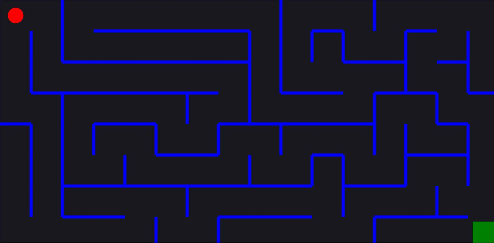

# Maze Game with JS

A Maze game using Matter.js to generate the shapes and efects. 

To move the ball use:

##### In this project I learn about:
* To use the library Matter.js
* Generate a maze randomly
* Shuffle algorithm
* forEach method
* Refactoring the code to generate any type of maze

Check the simple app clicking [here](https://richardbmk.github.io/mazegame/).

